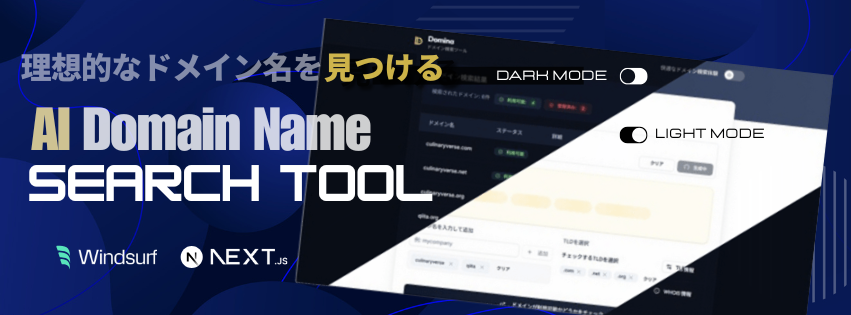

  

    
    
    
    
    
    
    
    
    
    
    
    
    
  

  <h3 align="center">AI DOMAIN NAME SEARCH TOOL</h3>

  

    ドメイン名選定支援 AI ツール
  

## 📋 <a name="table">もくじ</a>

1. 🤖 [はじめに](#intro)
2. 🔗 [URL](#url)
3. 😮‍💨 [ドメイン名選定支援 AI ツール Domina の概要](#description)
4. 🔋 [Domina の機能](#feature)
5. 💻 [画面サンプル](#screen_sample)
6. 🤸 [終わりに](#outro)

## <a name="intro">🤖 はじめに</a>

ドメイン名の発想から可用性チェック、詳細情報取得までを一括でサポートする、ドメイン名選定支援 AI ツール、**Domina** を紹介します。

Domina の作成にはコーディングは一切行わず、AI（Calue 3.7 Sonnet）と対話しながら設計・作成・修正を進めた「100% AIコーディング」アプリです。

## <a name="url">🔗 URL</a>

Domina | AI DOMAIN NAME SEARCH TOOL  
https://domina-windsurf.vercel.app

---

## <a name="description">😮‍💨 Domina の概要</a>

**Domina（ドミーナ）** は、**AI を活用してビジネスアイデアやキーワードから創造的なドメイン名を生成し、そのドメインが利用可能かをリアルタイムでチェックできる Web サービス**です。

Domina は、**100% AI がコーディングしたアプリ** です。
コーディングはせず、AI に設計、作成、修正の指示をすることでアプリを構築しました。

### おもな特徴

#### 🥳 AI によるドメイン名の提案

**ビジネスアイデアや希望のキーワードを入力** すると、Gemini AIが最適なドメイン名を複数提案します。

#### 👯 その場でドメインが利用できるかチェック

提案されたドメインについて、**その場で利用可能かどうかを自動チェックし** ます。

#### 💾 WHOIS 情報（フーイズ）表示

すでに登録されているドメインについては、「そのドメインを誰が持っているか」「いつ登録されたか」「いつまで使えるか」などの情報を見やすく表示します。

#### 💾 ワンストップの直感的な操作で結果を取得

ドメイン名選びや取得可否の確認を、ワンストップかつ直感的に行えるのが特徴です。

#### 🤹‍♀️ 想定される利用シーン

- 新規ビジネスやプロジェクトのための **理想的なドメイン名探し**
- ドメイン取得前の **アイデア出しや競合調査**
- ドメインの **空き状況や詳細情報の即時確認**

#### 🔨 技術的背景

ドメイン名選定支援 AI ツール、Domina は、AI コードエディタ、Windsurf を使って作られています。
アプリの作成に利用している AI モデルは、Calue 3.7 Sonnet です。
コーディングは一切せず、AI との対話のみでアプリを作成しました。

---

## <a name="feature">🔋 Domina の機能</a>

- ✨ ヒーローセクション
- 💡 ドメイン名提案セクション
- ➕ ドメイン名追加セクション
- 🌐 TLD 選択セクション
- 🗂️ TLD 選択モーダル
- ✅ ドメイン可用性チェック機能
- 🔍 検索結果セクション
- 💾 ストレージ保存機能
- 🛠️ フィーチャーズセクション
- 📌 スタイル切り替わり固定ヘッダ
- 🌙 ダークモード切替テーマ

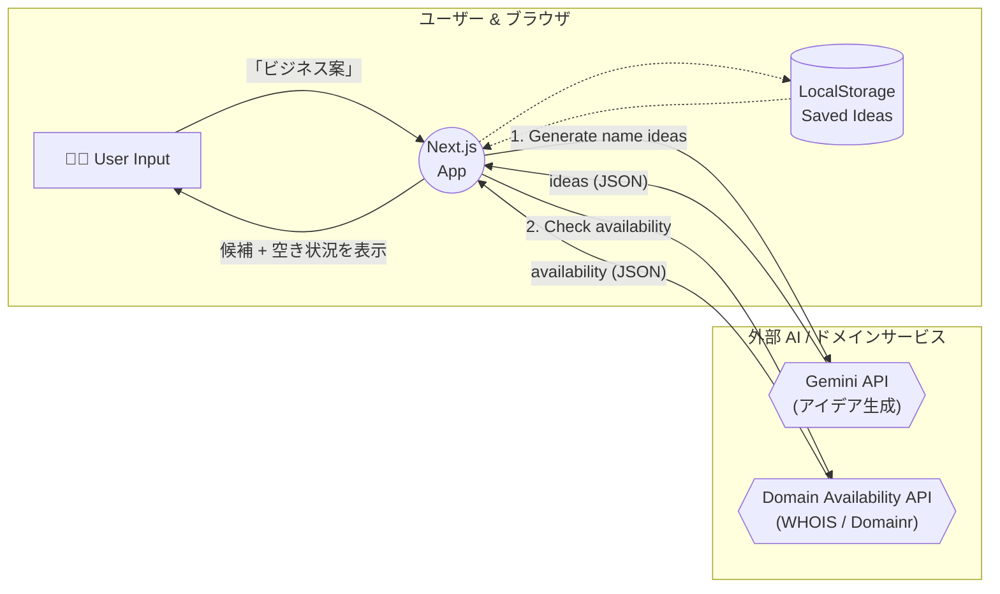

---

## <a name="screen_sample">💻 画面サンプル</a>

### 生成ロゴ指定への入口

### ✨ ヒーローセクション

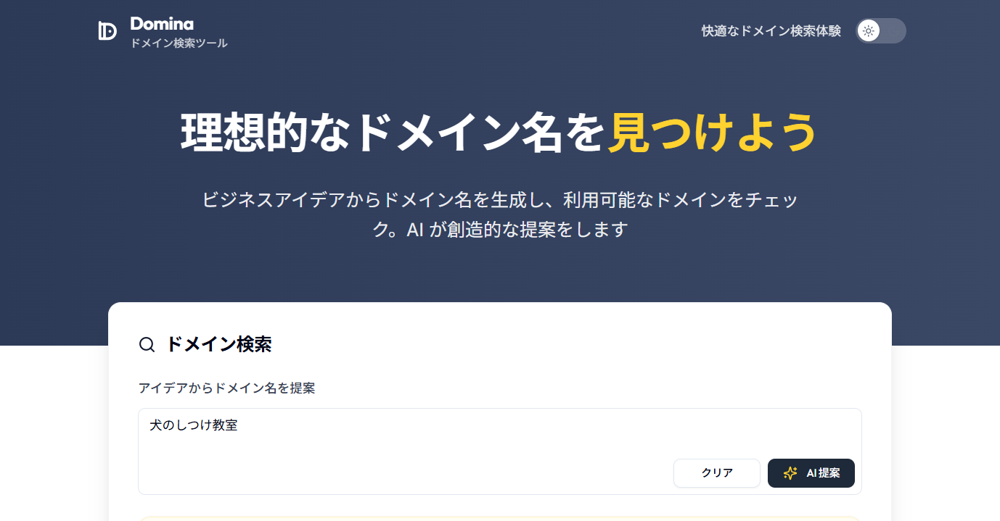

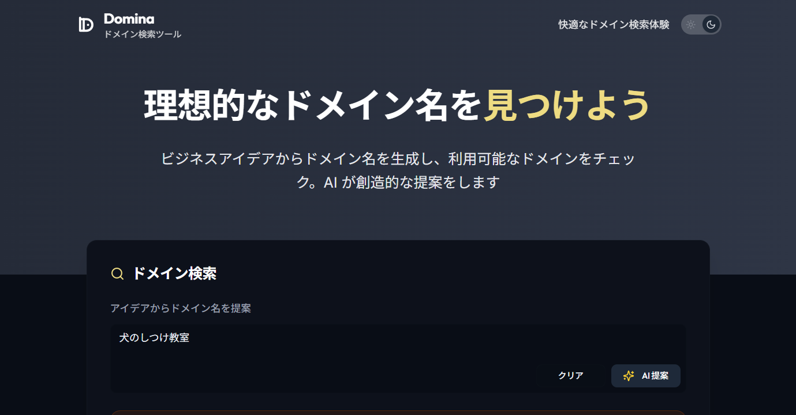

- ユーザにサイトのポイントを伝えるメッセージを表示

### 💡 ドメイン名提案セクション

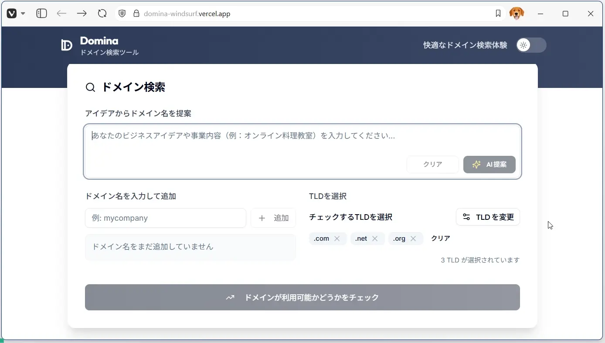

- ドメイン名を検討しているビジネスアイディア、プロジェクト内容を入力できる
- 「AI 提案」ボタンをクリックすることで、AI 提案のドメイン名を５つ表示
- 「クリア」ボタンをクリックすることで、入力内容をクリア
- AI 提案の問い合わせ中はローディング表示（スケルトン表示）

### ➕ ドメイン名追加セクション

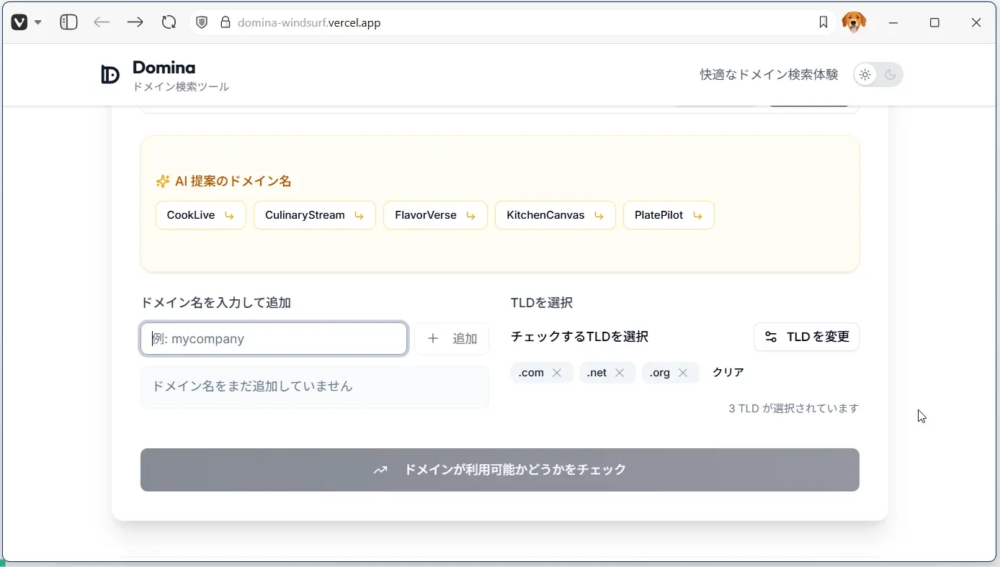

- 入力フォームに入力してドメイン名を追加
- 正規表現を用いた入力チェック（「.com」などの部分を抜いたベースのドメイン名の形でないとチェックエラー）
- 追加したドメインをタグとして表示
- 「×」ボタンを押すことで、各タグをクリア
- 「クリア」ボタンを押すことで、すべてのタグをクリア

### 🌐 TLD 選択セクション

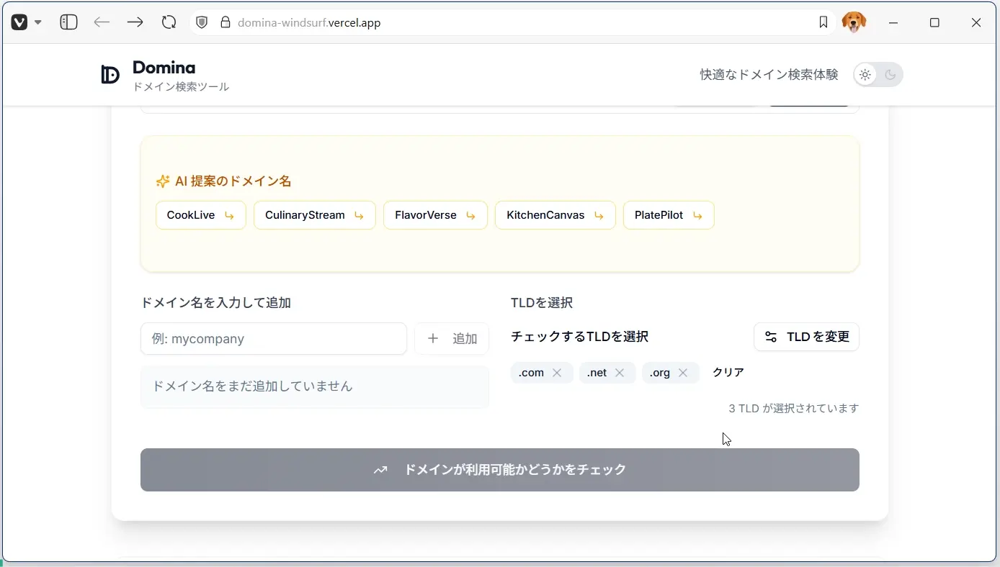

- 「TLD を変更」ボタンを押すことで、TLD 変更モーダルを表示
- 選択中の TLD をタグで表示
- 「×」ボタンを押すことで、各タグをクリア
- 「クリア」ボタンを押すことで、すべてのタグをクリア
- 選択中の TLD の数を表示

### 🗂️ TLD 選択モーダル

- チェックできる TLD を「一般」「ビジネス」「テック」「国別」のカテゴリ別に表示
- 各チェックボックスで選択、未選択を管理
- 「キャンセル」ボタンを押すことで、変更内容を反映せずモーダルを閉じる
- 「適用」ボタンを押すことで、変更内容を反映してモーダルを閉じる
- モーダルの「×」ボタンを押すことで、変更内容を反映せずモーダルを閉じる
- 「適用」ボタンに選択中の TLD の件数をバッジ表示
- 「すべて解除」ボタンを押すことで、すべての TLD のチェックを外す
- 「すべて選択」ボタンを押すことで、すべての TLD にチェックを入れる
- TLD 全何件中、何件選択中かをメッセージ表示

### ✅ ドメイン可用性チェック機能

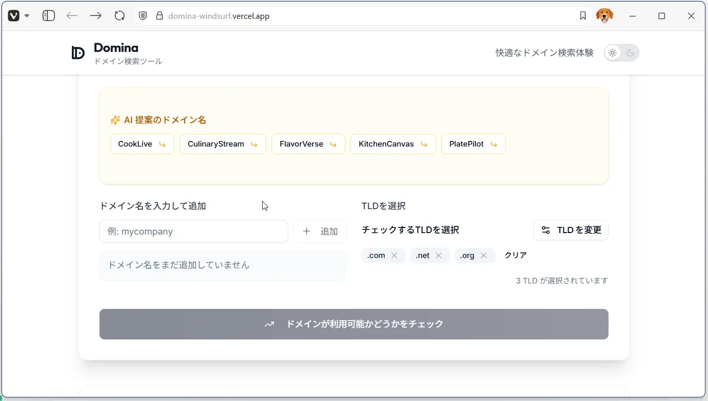

- 「ドメインが利用可能かどうかをチェック」ボタンを押すことで、ドメインの可用性チェックを開始
- 何個のドメイン名、何個の TLD を組み合わせて、合計で何個のドメインの一括チェックをするか表示

### 🔍 検索結果セクション

- 検索結果プレースホルダーがあり、チェック完了後にドメインごとのステータス一覧が表示される設計（利用可 / 登録済みをバッジや色で区別）​
- 登録済みドメインの場合は詳細な WHOIS 情報を日本語で展開表示できる（レジストラ名、作成日、更新日など）​

### 💾 ストレージ保存機能

- すべての入力内容、選択内容はローカルストレージに保存されるため、情報の再入力の手間がない

### 🛠️ フィーチャーズセクション

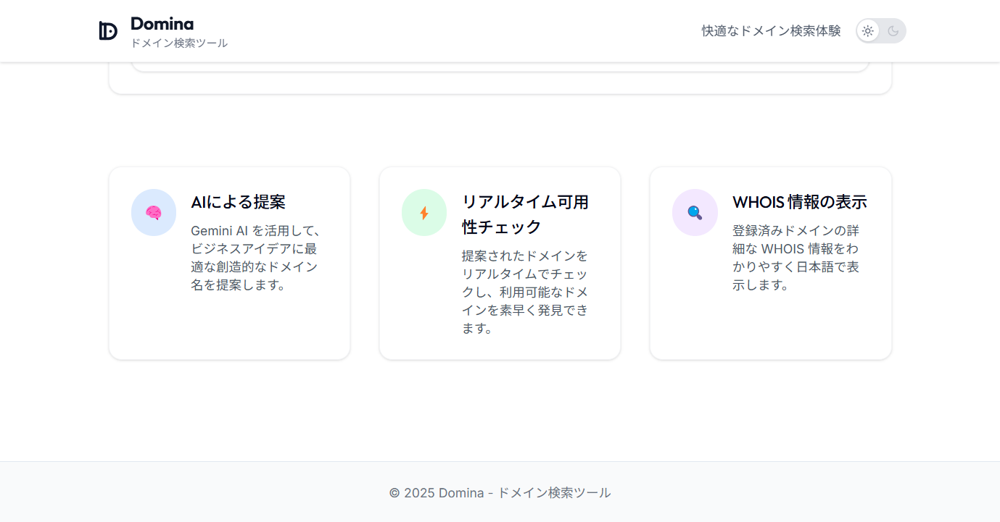

- ツールのおもな機能を絵文字アイコンとタイトル、メッセージをカード形式で表示

### 📌 スタイル切り替わり固定ヘッダ

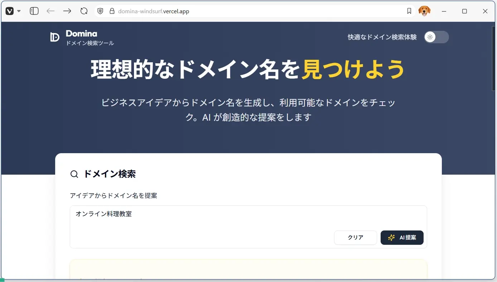

- 下にスクロールをしてヒーローセクションを通り過ぎるとスタイル変化する固定表示のヘッダ

### 🌙 ダークモード切替テーマ

- スイッチを切り替えることでライトモード/ダークモード表示の切り替えが可能

|ライトモード |ダークモード |
|:-- |:-- |
|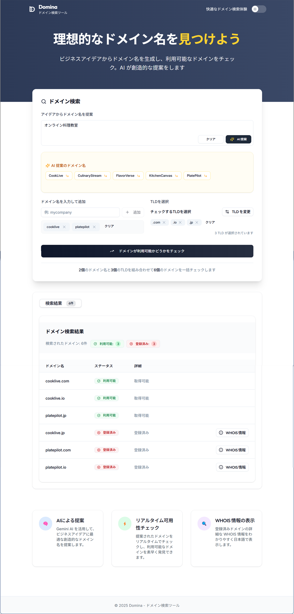 |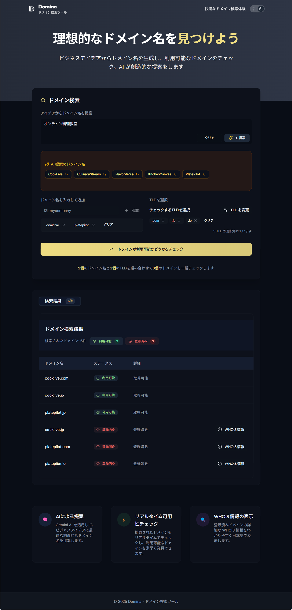 |

---

## <a name="outro">🤸 おわりに</a>

Domina では **AI を活用した「ドメイン名のブレインストーミング」と「リアルタイム可用性チェック」をワンストップで提供**しています。

ビジネスアイディアを入力するだけで、ブランドのニュアンスを汲み取った候補を瞬時に生成し、TLD を組み合わせて取得可否まで確認できる ― このアプリをコーディングしたのは AI です。

必要な要件、仕様、技術選定、設計を AI と対話することで決定し、コーディング、修正の指示を繰り返すことでアプリを完成させました。

今回は小さなプロジェクトですが、上手くコントロールしていけば、より大きなプロジェクトを作成することも可能です。
